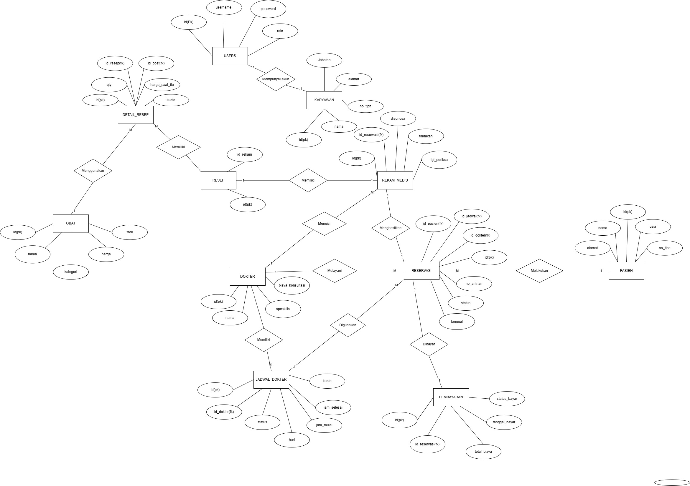

# Aplikasi-Poli-Klinik
---
## Nama Anggota
- Muhammad Ihsan
- Naiy Tri Desianti
- Shayna Difitri Ramadhani
---
## ERD Aplikasi Poli Klinik

## Trigger Yang Akan Digunakan
```
1. Trigger: Perhitungan Subtotal Otomatis
   Nama Trigger : trg_hitung_subtotal
   Tabel : detail_resep
   Event : AFTER INSERT, UPDATE
   Deskripsi : Menghitung subtotal secara otomatis dari qty × harga_saat_itu
2. Trigger: Validasi Stok Obat
   Nama Trigger : trg_validasi_stok
   Tabel : detail_resep
   Event : BEFORE INSERT, UPDATE
   Deskripsi : Mengecek agar qty tidak melebihi stok yang tersedia
3. Trigger: Update Total Pembayaran
   Nama Trigger : trg_update_total_pembayaran
   Tabel : detail_resep
   Event : AFTER INSERT, UPDATE
   Deskripsi : Memperbarui total_biaya berdasarkan subtotal obat dan biaya konsultasi
```
